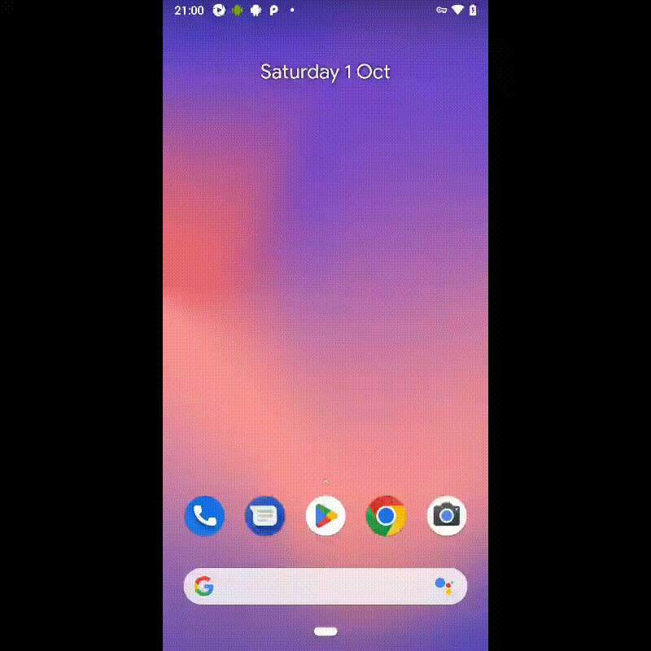

# Тестирование мобильного приложения Wikipedia
[](https://github.com/wikimedia/apps-android-wikipedia/releases/download/latest/app-alpha-universal-release.apk) 

*Добро пожаловать в [Википедию](https://ru.wikipedia.org/wiki), свободную энциклопедию, которую может редактировать каждый.* 


### В проекте реализована :mag_right:
* Проверка текста экранов приветствия
* Проверка загрузки изображений экранах приветствия
* Проверка поиска по статьям
* Проверка показа капчи при регистрации
* Проверка видимости пароля после тапа на значок глаза
* Проверка авторизации
* Проверка добавления русского языка
* Проверка поиска языка в справочнике

### В проекте использованы :gear:


## Для запуска тестов
### локально в терминале :computer:
```
gradle clean test -DdeviceHost=emulation
```
### удаленно в Jenkins :desktop_computer:
```
gradle clean test
-DdeviceHost=browserstack
```
[Пример сборки](https://jenkins.autotests.cloud/job/012-sesterca-u21-browserstack_mobile_tests/35/)
Открыть [Jenkins](https://jenkins.autotests.cloud/job/012-sesterca-u21-browserstack_mobile_tests/), в меню слева выбрать ```Собрать с параметрами```

#### Главный экран отчета Browserstack


## Для просмотра отчета
Под названием проекта кликнуть [](https://jenkins.autotests.cloud/job/012-sesterca-u13_employee_naumen_website/allure/)

#### Экраны просмотра отчета о прохождении тестов Allure


#### Пример выполнения теста


## Для уведомления о результатах тестирования

